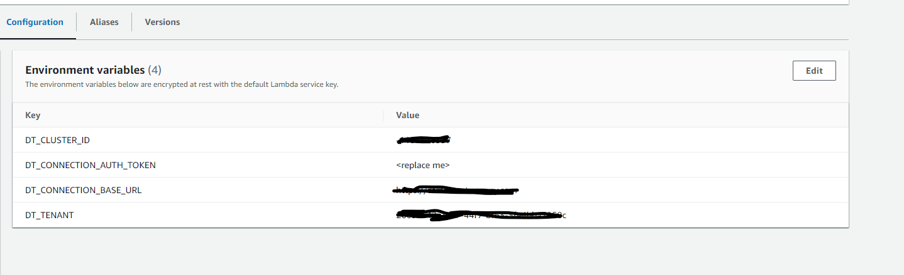

# Dynatrace Open Telemetery example without layer

## Deploying function
dotnet lambda deploy-function MySimpleFunction
PS: Requires aws secrets etc configured
## Links to documentation
https://www.dynatrace.com/support/help/setup-and-configuration/setup-on-cloud-platforms/amazon-web-services/aws-lambda-otel-integration/integrate-opentelemetry-lambda/opentelemetry-on-aws-lambda-dotnet

## Lambda environment variables

### Other references and stuff
https://ig.nore.me/2016/03/setting-up-lambda-and-a-gateway-through-the-cli/